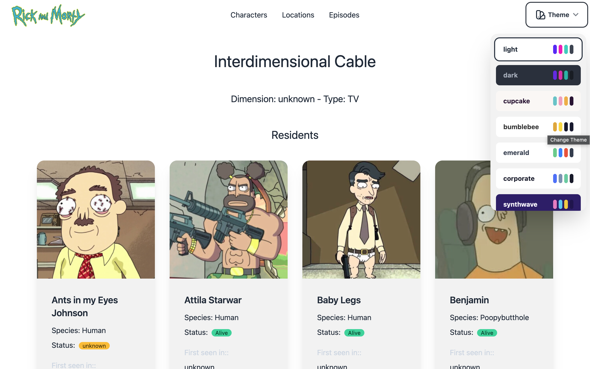
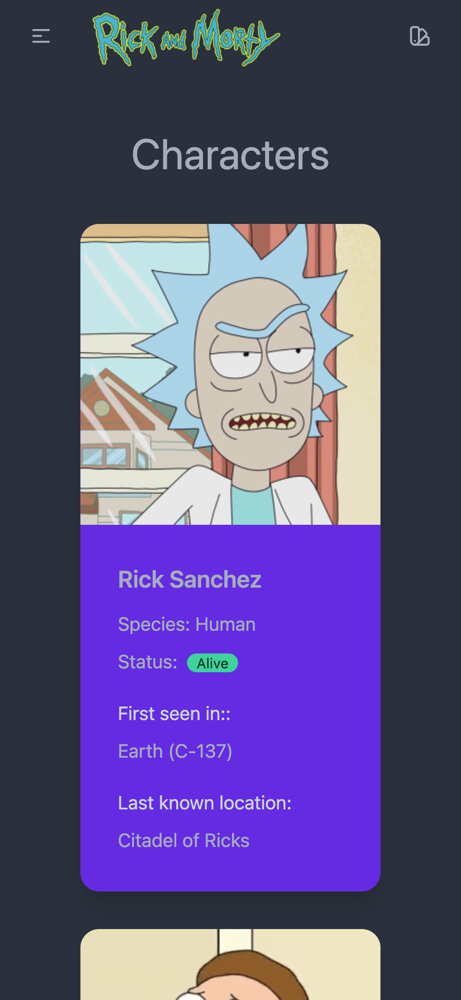

# Rick and Morty

[![Build][docker-build-badge]][docker-build-link]
[![npm][license-icon]][license-link]

This is an Angular project that consumes the





## Running

### Docker

Build:

```zsh
DOCKER_BUILDKIT=1 docker build --pull -f "Dockerfile" -t rickandmorty:latest "."
```

Serving the app on port **8080**:

```zsh
docker run -p 8080:80 rickandmorty
```

### Traditional

**Requisites**: Node, Angular and a package manager ([npm][npm-link], [yarn][yarn-link], [pnpm][pnpm-link] or [bun][bun-link]).

Serving the app on port **4200**:

```shell
npm install && ng serve
```

## Copyright

Rick and Morty is created by Justin Roiland and Dan Harmon for Adult Swim. The data and images are used without claim of ownership and belong to their respective owners.

This application is open source and uses a [Creative Commons CC0 1.0 Universal license][license-link].

[docker-build-link]: https://github.com/vitormmatos/vitormmatos.github.io/actions/workflows/build.yml
[docker-build-badge]: https://github.com/vitormmatos/vitormmatos.github.io/actions/workflows/build.yml/badge.svg?branch=main
[license-icon]: https://flat.badgen.net/npm/license/cc-md
[license-link]: https://github.com/idleberg/Creative-Commons-Markdown/blob/main/4.0/zero.markdown
[api-link]: https://rickandmortyapi.com/
[npm-link]: https://www.npmjs.com/
[yarn-link]: https://yarnpkg.com/
[pnpm-link]: https://pnpm.io/
[bun-link]: https://bun.sh/
